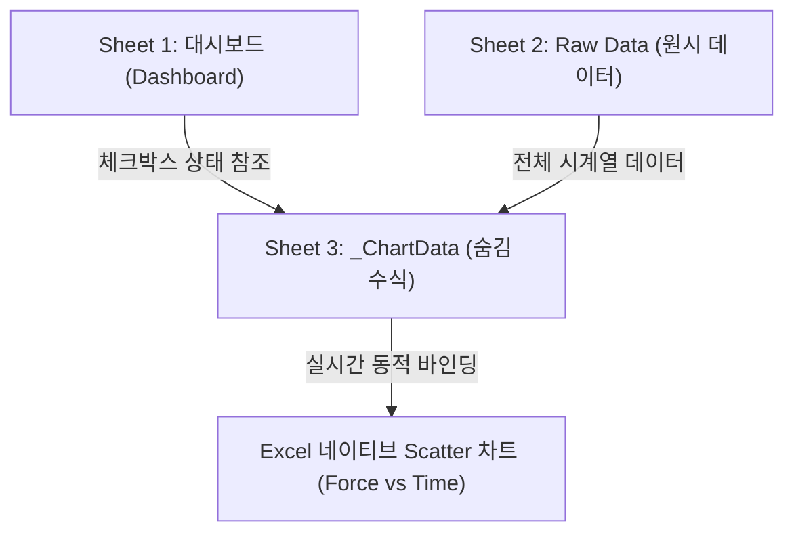

# SP-2100 / TL-2200 박리·인장 시험기 통합 기술 매뉴얼

> 본 문서는 **SP-2100 및 TL-2200 (박리력·인장 시험기)**의 하드웨어 통신 프로토콜, 신호 역공학 디코딩, 핵심 트러블슈팅 이력, 웹 인터페이스 기능, 그리고 대시보드 연동 XLSX 내보내기 시스템까지의 모든 구현 사항을 총정리한 단일 기술 기준 문서(SSOT)입니다.

---

## 1. 개요 및 장비 스펙 비교

SP-2100과 TL-2200은 점착 테이프 및 필름의 박리력(Peel Force)과 인장 강도를 측정하는 고정밀 물성 시험기입니다. 장비 내부의 마이크로컨트롤러(ComLink 시스템)와 RS-232 시리얼 통신으로 연결되어 측정값과 시계열 파형 데이터를 주고받습니다.

### 1-1. 통신 사양 비교표

| 항목 | SP-2100 | TL-2200 |
|---|---|---|
| **통신 방식** | RS-232 시리얼 (Web Serial API) | RS-232 시리얼 (Web Serial API) |
| **Baud Rate** | **57,600 bps** (표준 권장) | **38,400 bps** (ComLink 기본값) |
| **Data / Parity / Stop** | 8-N-1 (Data 8, Parity None, Stop 1) | 8-N-1 (Data 8, Parity None, Stop 1) |
| **종단 문자** | CR (`\r`, 0x0D) | CR (`\r`, 0x0D) |
| **폴링 명령** | 능동 폴링 없음 (장비 자율 전송) | `R\r` (300ms 주기 폴링) |
| **측정 요약 포맷** | 라벨 기반 ASCII (`"AVG",71.5`, `"PEAK",...`) | 위치 기반 다중 컬럼 CSV (`TL-22OO, ...`) |
| **파형 데이터 포맷** | ComLink 바이너리 프레임 (8bit/16bit) | 다중 섹션 ASCII Delta 압축 스트림 |
| **일반 샘플 수** | 측정 시간에 따라 가변 (약 500~2,000 pts) | 약 5,860 pts (Delay 978 + Avg 4,882) |

---

## 2. 신호 분석 및 역공학 디코딩 (Reverse Engineering)

SP-2100과 TL-2200은 원시 시리얼 데이터를 파싱하는 구조가 완전히 다릅니다.

### 2-1. TL-2200 전용 다중 라인 파이프라인

TL-2200은 1회 측정 완료 시 여러 줄에 걸쳐 방대한 텍스트 및 ASCII 델타 스트림을 전송합니다.

```
[Line 1] 헤더 CSV: seq, time, date, vn:..., TL-22OO, sn:..., SP, KP, VAL, AVG, RMS, ...
[Line 2] Delay 헤더: 978, 1.0000, ... (샘플수, 딜레이 시간)
[Line 3] Delay 파형: ASCII Delta 압축 문자열 (978자)
[Line 4] Average 헤더: 4882, 5.0000, ... (샘플수, 평균 시간)
[Line 5] Average 파형: ASCII Delta 압축 문자열 (4882자)
```

#### 핵심 디코딩 규칙 (ASCII Delta 테이블)
TL-2200의 파형 문자열은 누적 델타(Delta Increment) 방식으로 인코딩되어 있습니다. 각 바이트(Char Code)의 역할은 다음과 같습니다:

| 바이트 범위 (Hex) | Char Code | 의미 및 계산식 | 비고 |
|---|---|---|---|
| `0x20`, `0x2D` | 32, 45 | Skip | 스페이스 및 하이픈은 파싱에서 무시 |
| `0x2A` | 42 | Delta = 0 | 직전 측정값 유지 (`*`) |
| `0x2B` | 43 | Delta = +13 | 큰 양수 증가 점프 (`+`) |
| `0x2C` | 44 | Delta = -13 | 큰 음수 감소 점프 (`,`) |
| `0x2E ~ 0x39` | 46 ~ 57 | Delta = `-(b - 45)` | 미세 음수 감소 (`.` ~ `9`) |
| `0x3A ~ 0x7A` | 58 ~ 122 | Delta = `+(b - 58)` | 일반 양수 증가 (`:` ~ `z`) |
| **`0xBA ~ 0xFE`** | **186 ~ 254** | **Delta = `-(b - 185)`** | **일반 음수 감소 (핵심 역공학 발견)** |
| `0x1B` (`ESC`) | 27 | 절대값 점프 | 직후 4문자를 결합하여 절대값 동기화 |

> ⚠️ **치명적 주의점 (7비트 마스킹 금지)**  
> 초기 코드에서 문자열 수신 시 관행적으로 수행하던 `b & 0x7F` 마스킹을 적용하면, 상위 비트가 켜진 `0xBA~0xFE` 음수 델타가 강제로 일반 양수 문자로 변환되어 **힘을 뺐는데도 파형이 반대로 치솟는 치명적 왜곡**이 발생합니다. 반드시 8비트 전체(Latin1) 바이트를 온전히 보존하여 처리해야 합니다.

### 2-2. SP-2100 바이너리 프레임 디코딩

SP-2100은 400ms 이상의 무신호 구간을 기준으로 ComLink 프레임을 분리하며, 바이너리 바이트 스트림을 수신합니다:
1. **8비트 및 16비트 후보 생성**:
   - 8-bit: `(byte - 128) * SCALE * FACTOR`
   - 16-bit: 정렬(`a0`, `a1`) × 엔디언(`LE`, `BE`) × 부호(`U`, `S`) = 총 8가지 조합
2. **PEAK 기반 최적 후보 자동 선택**:
   - 장비가 보고한 `PEAK` 값과 각 후보 파형의 최대치 간 오차를 비교하여 가장 일치하는 디코더를 자동 채택합니다.
   - 스케일 오차가 있는 경우 PEAK 비율(`ratio = peak / rawMax`)로 진폭을 실시간 보정합니다.

---

## 3. 핵심 트러블슈팅 및 버그 해결 이력

### [이슈 1] 1회 측정 시 2개 행 중복 등록 버그
- **증상**: 시험기에서 1번 측정했을 뿐인데 테이블에 2개의 측정 행이 연속으로 추가됨.
- **원인**: `onLine()` 핸들러에서 라인 단위 헤더 CSV 수신 시 1차 커밋하고, 이후 800ms 무신호 타이머로 프레임이 종료되어 파형이 조합될 때 `processFrame()`에서 2차 커밋함.
- **해결**: `onLine()`에서는 로그 출력만 수행하고, 레코드 등록은 파형과 수치가 완벽히 결합되는 `processFrame()`에서만 단독으로 수행하도록 통합. 또한 1.5초 이내 동일 AVG/KP 수신 시 중복 등록을 차단하는 가드 로직 탑재.

### [이슈 2] 힘을 줬다 뺐는데 파형에 반영되지 않던 버그
- **증상**: 2초 후에 200g 이상 힘을 가했다가 4초 후 힘을 뺐으나, 화면 그래프 파형이 내려오지 않고 왜곡됨.
- **원인**:
  1. `fullText` 생성 시 `b & 0x7F` 7비트 마스킹으로 인해 음수 델타(`0xBA~0xFE`)가 전부 양수로 뒤집힘.
  2. 헤더 라인의 시퀀스 번호(예: `10, 00:51:01...`)가 `\d{2,6}` 정규식에 걸려 Delay 라인(978개)을 건너뛰고 4882개만 수신됨.
- **해결**:
  1. 8비트 원본 Latin1 디코딩으로 복원하여 음수 델타 공식(`-(b - 185)`) 정상 작동.
  2. 헤더 필터링 및 `\d{3,6}` 정규식 보강으로 Delay(978개) + Avg(4882개) 총 5,860여 개 샘플 전체를 순서대로 결합.

### [이슈 3] 단일 행 덮어쓰기 기능
- **규칙**: 측정 기록 표에서 체크박스를 **정확히 1개만** 체크한 상태에서 장비 측정을 새로 진행하면, 새 행을 추가하지 않고 **체크된 기존 행에 측정값과 파형을 제자리 덮어쓰기**합니다 (덮어쓰기 완료 후 체크 자동 해제).

---

## 4. 웹 인터페이스 및 실시간 차트 기능

1. **2컬럼 레이아웃 (`instruments/sp2100_logger.js`)**:
   - 좌측 사이드바: 장비 모델(SP-2100 / TL-2200), 보레이트(38400 / 57600), 테스트 조건(속도, 지연, 평균시간, 샘플명).
   - 우측 센터 패널:
     - 실시간 라이브 LED 디스플레이 (단위: g).
     - 상단 좌측: **현재 파형 그래프 (힘-시간, 70% 너비)**.
     - 상단 우측: **AVG 분포 박스-수염 차트 (30% 너비)**.
     - 하단: **측정 기록 테이블**.
2. **마우스 드래그 구간 분석 (Web UI)**:
   - 파형 그래프 캔버스 위에서 마우스를 좌클릭 후 드래그하면 하늘색 반투명 음영 구간이 생성됩니다.
   - 드래그를 반복하면 기존 구간을 유지하면서 복수 구간을 누적합니다. 각 구간은 별도 색상과 칩(`#1`, `#2`, ...)으로 표시됩니다.
   - 구간별 평균·최소·최대·시간 범위와 함께, 복수 구간의 중복 포인트를 제거한 **통합 평균·통합 최소·통합 최대·총 포인트 수**를 표시합니다.
   - `✕`로 전체 또는 개별 구간을 해제하고, `✓ 적용하기`로 선택 통계를 현재 측정 행의 `AVG/KP/VAL`에 반영할 수 있습니다.
   - 적용 전 장비 원본값은 보존되며 `↺ 원본 복구`로 언제든지 원상 복구할 수 있습니다.
3. **Y축 스케일 오버레이**:
   - 마우스 호버 시 Y축 상/하단에 숫자 입력 박스가 나타나며, 수동 입력 시 즉시 해당 범위로 고정됩니다. `↺` 버튼 클릭 시 자동 스케일로 복귀합니다.

---

## 5. 대시보드 및 Raw Data 동적 XLSX 내보내기 시스템

기존 단순 CSV 내보내기를 폐기하고, **키슬리 2400 아키텍처 기반의 인터랙티브 Excel(`*.xlsx`) 통합 문서 시스템**으로 전면 교체하였습니다.

### 5-1. 시트별 구조 설계



#### Sheet 1: `대시보드` (Dashboard)
- **박리력 비교 그래프 (Force-Time)**:
  - Excel 네이티브 `<c:scatterChart>` (분산형 차트) 탑재.
  - 수천 개 데이터 포인트 뭉침을 방지하기 위해 마커 크기를 **`size="2"` (기본 크기 대비 1/3)**로 대폭 축소하고 선 두께를 **`1.0pt`**로 최적화.
- **체크박스 (`☑` / `☐`) 드롭다운 연동**:
  - 첫 번째 열에 영문 `TRUE` 대신 유니코드 체크박스 기호(`☑`) 표시.
  - 데이터 유효성 검사 드롭다운 목록(`☑`, `☐`)을 탑재하여 셀 클릭 시 원클릭으로 선택/해제 가능.
- **📍 구간 분석 설정 및 자동 계산 컨트롤**:
  - 요약표 바로 위에 `시작 시간 (s): [ 1.0 ] ~ 종료 시간 (s): [ 6.0 ]` 입력 셀 배치.
  - 요약표 내에 3개 네이티브 통계 수식 열 탑재:
    - **구간 평균 (g)**: `=AVERAGEIFS('Raw Data'!힘, 'Raw Data'!시간, ">="&$C$32, 'Raw Data'!시간, "<="&$E$32)`
    - **구간 최소 (g)**: `=MINIFS('Raw Data'!힘, 'Raw Data'!시간, ">="&$C$32, 'Raw Data'!시간, "<="&$E$32)`
    - **구간 최대 (g)**: `=MAXIFS('Raw Data'!힘, 'Raw Data'!시간, ">="&$C$32, 'Raw Data'!시간, "<="&$E$32)`
  - 사용자가 엑셀에서 시작/종료 시간 숫자만 바꾸면 엑셀이 실시간으로 해당 구간의 평균/최소/최대를 즉시 재계산.

#### Sheet 2: `Raw Data`
- 평가 회차별 메타데이터(제품명, AVG, SP, KP, VAL, RMS, 속도, 지연, 평균시간, 총 샘플수) 기록.
- 시간(`시간 (s)`)과 힘(`힘 (g)`) 전 구간 시계열 원시 측정값 수천 행을 정갈하게 테이블 형태로 정리.

#### Sheet 3: `_ChartData` (숨김 수식 시트)
- 대시보드 차트의 실시간 온/오프를 제어하는 동적 수식 탑재:
  `=IF(OR('대시보드'!$A$row="☑", '대시보드'!$A$row=TRUE, '대시보드'!$A$row="TRUE", '대시보드'!$A$row=1), 'Raw Data'!force, NA())`
- 대시보드에서 특정 샘플의 체크를 해제(`☐`)하면 수식이 `#N/A`를 반환하여, 엑셀 차트에서 해당 샘플 곡선만 즉시 사라집니다 (1개만 보기, 여러 개 비교 보기 완벽 지원).

### 5-2. 파일 저장 위치

- **로컬 개발 서버(`python server.py`) 실행 시**:
  프로젝트 루트 폴더 바로 아래 저장 (`C:\...\3M Instrument Logger\SP2100_Dashboard_....xlsx`)
- **EXE 단독 실행 파일로 실행 시**:
  `3M_Instrument_Logger.exe` 파일이 있는 동일한 폴더에 자동 저장.
- **서버 API 없는 환경 (정적 호스팅/폴백)**:
  브라우저 기본 `다운로드(Downloads)` 폴더로 저장.
- 모든 저장 시 화면 좌측 하단 **SYSTEM LOG**에 실제 저장된 전체 경로 출력.

---

## 6. 소스 파일 색인 및 유지보수 가이드

| 파일 경로 | 역할 및 유지보수 주의사항 |
|---|---|
| `instruments/sp2100_logger.js` | SP-2100/TL-2200 장비 로직, 8비트 시리얼 수신, ASCII 델타 디코더, 파형 그래프, 복수 구간 분석·적용·원본 복구. `onLine`에서 커밋 금지! |
| `instruments/sp2100_xlsx.js` | 대시보드 XLSX 생성기. `buildSP2100ChartPlan`, `patchSP2100ChartXml`, `dashboardSheet`, `rawSheet`, `_ChartData` 수식 바인딩. |
| `assets/sp2100_export_template.xlsx` | 3개 시트 구조와 차트 스타일을 보존하는 원본 OOXML 템플릿. |
| `scripts/test_sp2100_xlsx.mjs` | 한/영 다국어 차트 플랜 및 OOXML 패치 무결성 검증용 단위 테스트. |
| `core.js` | 전역 다국어 번역 사전(`btn_xlsx`, `sp_xlsx_ok` 등) 및 시리얼 통신 컨트롤러. |
